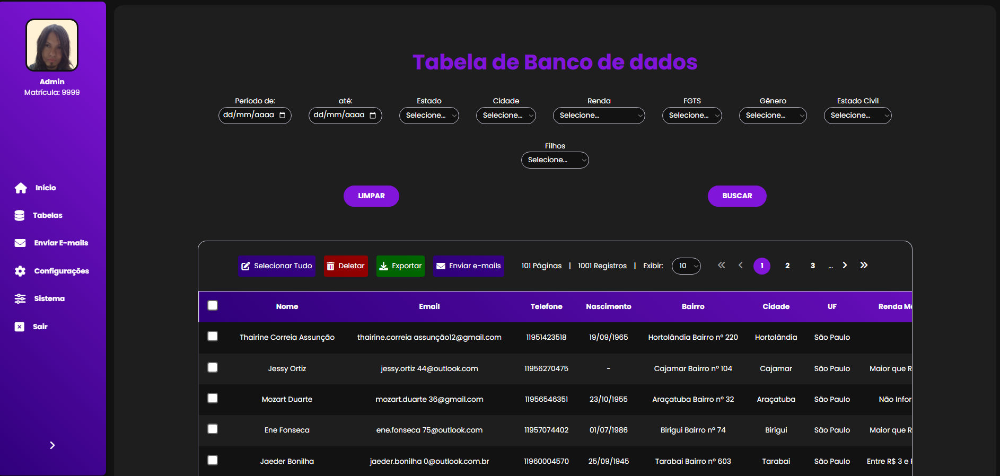
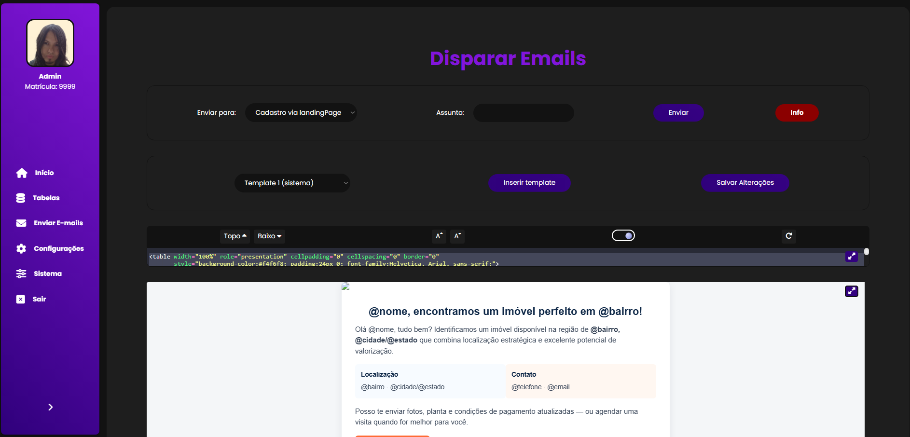
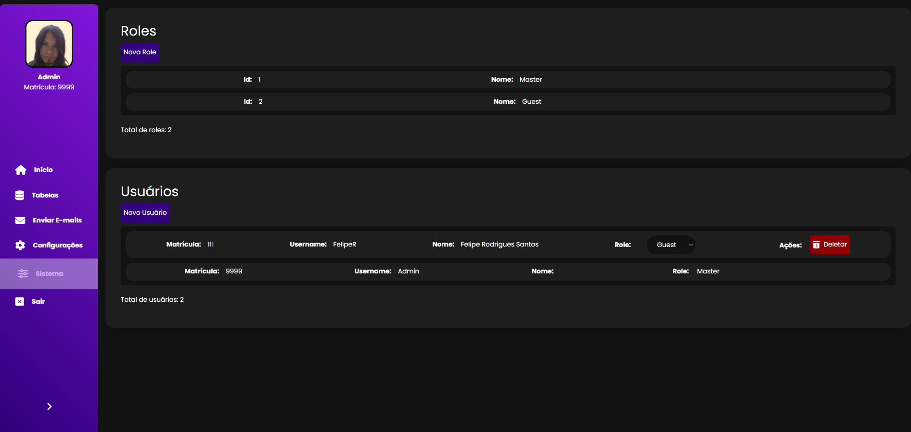

# Dashboard 📊

Dashboard que capta clientes através de uma landing page e administra esses dados.

<p align="center">
  <a href="#tecnologias-utilizadas-"><b>Tecnologias</b></a> •
  <a href="#como-rodar-o-projeto-"><b>Run</b></a> •
  <a href="#funcionalidades-"><b>Funcionalidades</b></a> •
  <a href="#estrutura-do-projeto-"><b>Estrutura</b></a> •
  <a href="#configuração-do-projeto-"><b>Configuração</b></a>
  <a href="#roadmap--funcionalidades-futuras-"><b>Roadmap</b></a>
  <a href="#observações-"><b>Observações</b></a>
  <a href="#autor-Suporte-"><b>Autor</b></a>
</p>
<br>

---

## Tecnologias utilizadas 🛠️

* **Banco de dados:** MSSQL
* **Back-end:** .NET Core, ASP.NET Core, EF Core
* **Front-end:** Razor Pages / MVC (padrão do ASP.NET Core)

---

## Como rodar o projeto ▶️

O projeto pode ser baixado pelo link disponibilizado.
Para rodar localmente em modo debug, você precisa apenas do **.NET 6** e **ASP.NET Core** instalados.
O projeto já possui **migrations prontas**, portanto basta:

```bash
dotnet restore
dotnet build
dotnet run
```

O banco de dados será criado automaticamente a partir das migrations, caso ainda não exista.

---

## Funcionalidades ✨

1. **Landingpage** 📝 para captura de dados com formulário.
<p align="center"></p>
<br>

2. **Tela de login** 🔑 para acesso à dashboard.
<p align="center"></p>
<br>

3. **Tela inicial** 📈 exibindo gráficos com os dados capturados.
<p align="center"></p>
<br>

4. **Página da tabela de dados** 📊:

   * Visualiza todos os dados capturados
   * Filtragem de busca
   * Exportação para Excel 📄
   * Remoção de registros ❌
   * Seleção de clientes para envio de e-mails ✉️
<p align="center"></p>
<br>

5. **Página de envio de e-mails** 💌:

   * Criação e edição de templates
   * Envio via newsletter (apenas e-mails cadastrados)
   * Envio para clientes capturados pelo formulário
<p align="center"></p>
<br>

6. **Configurações de usuário** ⚙️:

   * Atualização de nome, e-mail, senha, tema e meta
<p align="center"></p>
<br>

7. **Configuração do sistema (apenas admin)** 👑:

   * Criação e edição de roles
   * Criação de novos usuários e alteração de roles
<p align="center"></p>
<br>

---

## Estrutura do projeto 📂

```
Dashboard
├─ Controllers
├─ Migrations
├─ Data           # Responsável pelo banco de dados
├─ Models
├─ Repositories
├─ Services
└─ Views
```

---

## Configuração do Projeto 🔧

Algumas configurações importantes estão no arquivo `appsettings.json`:

* **DefaultUser**: usuário administrador inicial que já vem criado no sistema.
* **GerarCadastrosTeste**: `true` gera 1000 cadastros fictícios para testes.
* **EmailConfig**: configuração do SMTP para envio de e-mails (email, senha, servidor e porta).

> ⚠️ Ajuste essas informações antes de rodar o projeto.

---

## Roadmap / Funcionalidades futuras 🚀

* Adicionar gráficos avançados de análise de dados
* Sistema de notificações em tempo real
* Integração com APIs externas para enriquecimento de dados

---

## Observações ⚠️

* O projeto é **para fins de estudo**, mas já implementa funcionalidades comuns em dashboards de gerenciamento de clientes.
* Todas as permissões de acesso são controladas via roles configuráveis.
* O sistema utiliza sessão e cookies para autenticação de usuários, sem necessidade de JWT.

---

## Autor / Suporte 📬

Para dúvidas ou sugestões sobre o projeto, entre em contato.

| [<br><sub>Felipe Rodrigues Santos</sub>](https://github.com/FelipeR-S) |  
| :---: |
